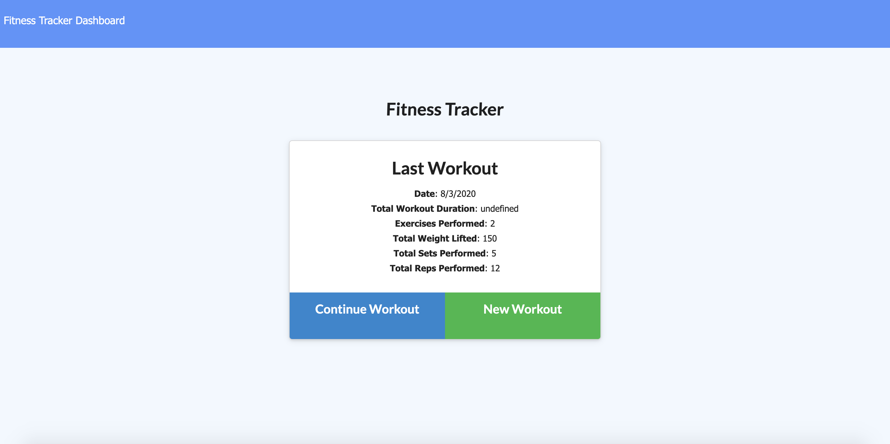

# Fitness-Tracker

The Fitness Tracker is a MongoDB and Node application that allows the user to create and track their workouts.

deployed link: https://thawing-fortress-31513.herokuapp.com/?id=5f28695cc0f1210017de3e42

repo link: https://github.com/bendrakeacker/Fitness-Tracker

